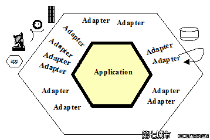

对会员后端开发的探讨
=========

### 当前开发模式概要：
- 结构：`controller -> service -> repository + framework + view`。必须由controller调用service，service调用repository，service和repository可调用framework内容。
- 从设计模式来看，属于`SOA`，以`service`为核心，虽然实际开发中大量的业务逻辑泄露到controller和repository中（甚至是view和js中）。
- 此设计对传统简单的MVC（即框架示例所描述的那样，其中的Model其实是用作ORM和业务逻辑载体的混合体）主要做了如下改动：将Model拆分成负责业务的Service和负责持久化的Repository，舍弃了ORM而采用Active Record。此种设计的一个优点是以下关注点分离：业务逻辑和持久化（基础设施）的分离。

### 实践中，出现了以下问题：
1. 业务泄露。本应属于Service的业务逻辑泄露到其他各层中（Controller、Repository、View等），而原本内容丰富的Service反而变成了贫血类。
2. 全能Service，主要表现是超多的代码（如vshop的商品和订单的Service代码都在1000行以上）和多方面的功能。例如OrderService，几乎只要是跟订单相关的都在此Service中，而没有进行进一步的精细建模。
3. 重复功能，表现在（特别是在跨模块时）重复的Service（如MemberService）和重复的方法。这些重复Service大部分地方一样，少数地方有区别。
4. 一些Service中充斥着各种各样的查询功能（列表和单记录查询），让这个Service看起来很怪异。
5. 贫血模型。基本都出现在Service层。多出现在查询的地方（列表、单记录）。因为我们默认约定Controller必须通过Service进行读写，而不能直接访问Repository，而实际上很多查询操作只需要Repository直接返回的数据即可，Service不需要做任何操作。
6. 以技术视角划分模块和系统。这将直接导致4.2.2的问题。例如，所有的作业任务都放在一个系统（如message-center），而作业必然会出现各自业务逻辑（如会员合并），因而同一套业务逻辑必然会出现在多处。
7. “前后台分离”。此处的分离是指按照前后台站点分离出完全独立的两套系统（如member-center何v-member，虽然商城是在一起，但基本也是两个完全独立的模块，而且v-shop这个名字起得很怪异，估计后本来准备分成两个，后来偷懒了搞成两个模块）。
8. 经典的“framework问题”。这个问题几乎困扰着全公司人，而且还会继续困扰下去。framework问题的实质是敏捷团队/公司和传统架构思维的阻抗，它实际上正印证着康威定律：组织结构决定着软件架构。该主题将在后面详细讨论。
9. OO无用论。一般在应聘时，我们都会在简历上写上“良好的OO基础”，但实际上我们骨子里是对OO持有怀疑和抵触的，而且实际开发中也是自觉不自觉地在面向对象框架中进行着面向过程的开发。问题是，为何我们那么抵触OO，那么喜欢过程式开发？另一个问题是，为何我们需要拥抱OO，相比于过程式开发能带来哪些好处？
10. 二维设计。或者说：“当我拿着MVC这把羊角锤时，全世界都是钉子”。当我们用MVC这一单一设计模式去解决一切问题时，就陷入了二维设计。我们无法立体地看待问题，无论是思考（设计）还是编码都是在平面上进行着（如Controller -> Service -> Repository的形式化调用）。这种思维方式往往导致形式化的流程和约束，而形式化的东西又往往束缚了人们的思想，进而不再去思考。
11. 耦合与内聚的纠缠。用辩证法的术语说，低耦合和高内聚是矛盾（辩证）统一的，高内聚的内部一定是高耦合的，低耦合的两个东西之间一定是低内聚的。当我们无法辨识出哪些元素之间应当是高内聚，哪些之间又应当是低耦合时，整体的高耦合便产生了（同时整体的低内聚也产生了，如分散在多处的同一套业务逻辑）——“牵一发而动全身”与“牵多发以动一处”。

### 相关设计模式和架构概述：
- **控制反转(IoC)** ：或说依赖倒置，属于SOLID五大原则之一(D)。

    描述：高层模块不应该依赖于低层模块，二者都应该依赖于抽象。抽象不应当依赖于细节，细节应当依赖于抽象。

    注意这里提到高层和低层，说明该原则主要是用来解决跨层的依赖问题（例如我们的Service和Repository）。一般，高层需要用到低层的东西（Service使用Repository），对低层产生依赖，那么当需要替换低层实现时，就需要改动高层代码。IoC要求，高层不应当依赖于低层实现，低层实现的变更也不应该影响高层。那么如何做到呢？接口，或说抽象。高层和低层遵守相同的抽象，并唯一据此抽象（接口）通信。

    再从另一个角度理解这个问题，就是将对象的使用和创建分离，使用者（调用者，依赖方）只是使用对象，而不负责创建它，创建工作由外部负责，这样当需要更换被依赖方的实现时，无需修改依赖方代码。比如说，我们的Service需要使用Repository，传统做法是在Service里面new一个Repository，现在要将原Repository替换成其他的（如原来是Db仓储，需换成Redis或nosql仓储），则需要修改所有使用了该Repository的地方。当使用IoC时，由于该Repository是由外部创建的，只需要调整外部。

    这种由原来的内部new变成由外部注入的实现方式，称为依赖注入（DI）。Yii框架里面的构造函数注入和服务容器（\Yii::$app->container）是DI的两种实现方式。

    IoC是设计原则，DI是该原则的实现方式。

    虽然该原则主要用来解决跨层依赖问题，但他同样适用于同层之间的解耦，如果这些依赖之间不是高内聚的话。（但是，每当出现同层的低内聚类之间的依赖时（例如聚合之间的调用），首先需要考察是否需要一个更高层次的协调者，例如一个Service）。

    另外需要注意的是，不要滥用IoC。虽然IoC是用来实现松耦合的很好方式，但软件设计中除了“松耦合”原则还有“高内聚”原则，高内聚的类之间是可以强耦合的，否则，很容易出现过度设计的问题。

    参见：http://www.tuicool.com/articles/JBRBzqm  《从百草园到三味书屋》，laravel作者著，里面有很好的示例诠释了依赖反转。

- **六边形架构（端口-适配器模式）** ：
    工作中，我们经常遇到以下难题：
        * 业务逻辑泄露到各层中，以及业务代码对输入输出的强依赖（请求对象、数据库存储对象等），很难干净的进行单元测试；
        * 开发时依赖于数据库、缓存系统的正常运行，一旦这些挂了，就无法开发了；
        当需要切换一个底层的技术实现时，需要改动相关业务层代码。

    六边形架构的目的：让程序能够以一致的方式被用户、程序、自动化测试、批处理脚本所驱动；并且，可以在与实际运行的设备和数据库相隔离的情况下开发和测试。

    例如，我们有会员合并的需求，而该需求的出现场景很多：web应用、api、后台批处理、消息队列异步处理等，目前，我们是在各场景分别写了一套合并逻辑，很难维护，而且合并逻辑本身和存储层是强耦合的，我们无法在忽略存储层的情况下进行单元测试（实际上，目前的代码根本无法进行单元测试）。按照六边形架构，web应用、api、后台处理都属于不同的输入源，这些需要和应用程序本身（会员合并业务）解耦，这些不同的输入源的不同输入数据需要通过各自的适配器适配成应用程序能理解的数据格式。适配器和应用程序接口遵守共同的契约（inteface），唯一通过该契约通信。输出端也是一样，应用程序本身不依赖于特定的输出端实现（web、api、单测、数据库），实现中也是通过各自的适配器根据各自的输出端技术将应用程序的输出转换适配成具体输出端需要的数据，如html、xml、具体数据库所需要的。

    当我们将应用程序中对外部的依赖从具体实现改成对接口的依赖，并且将泄露到外围（控制器、仓储层等）的业务逻辑封装进应用程序内部后，就可以很容易进行单测，例如很容易用mocker代替实际的web输入、存储层、缓存组件等。

    下面是六边形架构的图解：

    

    这里有两个层：**业务逻辑层** （领域 + 应用程序，目前可简单理解为领域层或业务逻辑层），也称之为应用程序（内层、内圆）； **外围设施层** （web、单测、数据库、缓存服务器等，外层、外圆）。内层不依赖于外层的存在而存在（如业务逻辑层在数据库不可用时应当仍然可通过其他方式代替数据库来运行）。内层通过暴露端口（api或函数调用）为外层提供功能（服务）或从外层接收数据——这很像操作系统的端口。端口的表现形式是契约interface（api或函数的入参以及返回值）。外层并不直接和内层打交道，而是通过各自的适配器来实现通信（控制器就是典型的适配器）。适配器将内层输出转换适配成其为之服务的外层设备所需的数据，或将外层设备的输入数据适配成内层所需要的数据。适配器和内层唯一通过契约（interface）通信。
举个例子：电脑需要接收各种外设的输入进行处理，这里的电脑就是内层应用程序，各种外设（u盘、手机、网络等）属于外层。为了对外通信，主机上有各种插槽（端口），每个插槽遵循不同的规格。外设通过适配器（如各种数据线和数据转换设备）和电脑进行数据交换，而适配器需要遵循两端协议：一端是电脑插口、一端是具体的外设插口。
IoC是实现六边形架构的有效手段：内层不应当依赖于外层实现，双方都应当依赖于接口定义——这也正是IoC的描述。但六边形架构还有一点：内层的业务逻辑不应当泄露到外层，因为一旦业务逻辑泄漏到外层，那么内层就不再是通用的、与外层实现无关的了，也就无法进行多边适配了。
另外需要注意的是，这里用的是“内层”和“外层”，并没有用上层和下层的说法，这里强调的是多边适配，而不是类似网络模型中的七层架构。
我们发现，在实际应用中，我们或多或少用到了六边形架构的东西（如IoC），但为啥代码还是难以测试难以维护呢？应用了六边形的某些东西不代表整个应用遵循六边形架构，比如我们用DI，但并不是特别清楚为啥要用DI，以及哪些地方要用哪些地方不需要用，更重要的，我们的业务逻辑并没有进行很好的封装与解耦，自然难以维护。
参考文章：http://blog.csdn.net/zhongjinggz/article/details/43889821 
c)GRASP九大设计模式：
GRASP系列设计模式主要是用来解决OOD中模块划分、职责分配问题，此处我们重点看下信息专家模式、创建者模式和低耦合模式。
信息专家模式：将职责分配给拥有履行一个职责所必需信息的类，即信息专家。
信息专家模式解决的是由谁来承担该职责问题。首先考察该职责（方法）需要用到的数据（信息）从何而来，一般是将职责分配给主数据源类。
例如，论坛系统有文章Article类和作者Author类，有发布文章的职责（publish方法），那么该职责由哪个类负责呢？先假设由Author类负责（从需求描述“张三发布一篇文章”来看，貌似属于Author的职责），像这样调用：Author::publish(Article)。我们发现，publish内部使用到的数据基本都是从Article来的（除了作者信息），当Article的数据结构有所变化时，同时需要修改Author类，并且在publish内部还需要调用Article类的方法进行业务规则校验。两者之间产生了很强的依赖关系，同时违反了SOLID原则中的单一职责、开放关闭等原则。如果将publish方法放到Article类中，那么所需要的数据都是自足的，校验规则也是内在的，不需要对外公开，也就保证了修改规则时不影响其他类。
信息专家模式需要结合高内聚和低耦合模式一起使用。比如实体对象的持久化问题(save())，持久化所用到的数据显然是实体对象的，按照信息专家模式，save()方法应该在实体类中，但从职责上来说，持久化属于低层技术实现，不属于业务逻辑，不应该由实体承担——我们用单独的仓储来负责实体的持久化工作。
创建者模式：谁应该负责产生类的实例？
该模式解决的是类的创建职责问题。B包含或聚合A，或直接使用A，则由B来创建A。
比如文章Article和作者Author，Article实例拥有Author实例的引用，那么由谁来创建这个Author对象呢？一种可能是通过Article构造函数从外界传入，由外界创建Author对象，但这样就将Article的内部细节暴露给了外界。更好的做法是由Article内部自己创建Author对象，隐藏实现细节。
创建者模式的使用同样需要结合高内聚低耦合模式。
再看另一个例子：每当文章发布后，需要给相关订阅者发送通知。ArticleService调用Article::publish()后，需获取订阅者列表并调用Email::sendMessage()给他们发送邮件。这里ArticleService使用了Email实例，按照创建者模式，是否应该由ArticleService内部创建Email实例呢？假如是的话，考虑下当以后需要替换Email实现时会发生什么？此时就需要挨个去找哪里使用了该Email实例，然后一个一个替换。显然此种情况需要用控制反转原则，由外界注入Email实例。
这两个例子有何区别？
前一个例子中，Article和Author属于聚合关系，是较强的关系，他们共同组成了业务整体，因而可以采用创建者模式，而且也应当使用该模式以隐藏内部细节。后一个例子中，ArticleService和Email纯粹是使用关系，是很弱的关系，而且两者是跨边界调用（ArticleService属于领域层，Email属于基础设施层），在六边形架构中，ArticleService在内圆，而Email在外圆，内圆不应当依赖于外圆的实现，因而这里不能采用创建者模式，而应当采用IoC以保持低耦合。
在创建者模式的条件列表中，“使用”列在最后，是最弱的关系，实际使用中，如果两者仅仅是“使用”关系，则要慎用创建者模式。
d)SOLID原则：
SOLID原则是面向对象设计和编程中最基本也最重要的五大经典原则(该单词是该五原则的首字母缩写)。下面一一讲解。
S.单一职责原则：
有且只有一个(一类)原因（理由）去改变一个类。
文章Article有publish()用来发表文章，也有save()用来保存文章到数据库中。
现在来考察下save()：将文章对象持久化到数据库。某一天，当持久化策略变了（用mongodb代替mysql），我们需要替换持久化引擎，此时就需要去修改这个save()方法了。“改变持久化策略”显然和Article没有直接关系，但却影响到了Article类，这就违反了单一职责原则。
O.开放封闭原则：
代码对扩展开放，对修改封闭。
文章发布后，需要给订阅者发消息。前面的做法是在ArticleService::publish()方法中获取订阅者列表，并调用Email::sendMessage()给其发消息。
现在，有这样的需求：只给最近三个月看过该作者文章的订阅者发消息。此时我们需要修改OrderService，在发送之前对每个订阅者做检查。再过几天，又有需求：只给关注了相关栏目的订阅者发消息......你会发现，随着需求的每次改动，ArticleService会被没完没了地改来改去（实际中我们正在做这样的事）。这里对修改是开放的。
因给订阅者发消息规则的变动而需要修改ArticleService，这本身违反了单一职责原则（SOLID原则都是互通的，违反其中一个往往也违反其他的）。可以在ArticleService::publish()中发布一个article-published事件，外部订阅该事件，这样可以在事件订阅端做任何业务扩展（对扩展开放）而不影响这里的类（对修改封闭）。
L.里氏替换原则:
一个抽象的任意一个实现，可以用在任何需要该抽象的地方。
有个IAnimal抽象定义了run()和sound()方法（发声），下面有实现类：Bird、Earthworm(蚯蚓)、Person，Bird和Person都对sound()做了各自的实现（发鸟声和人声），但Earthworm::sound()却throw了个异常。现在有个AnimalTrainer::train(IAnimal)这样的调用，想想会发生什么？当我们传入Earthworm对象时，其运行结果是未知的，有可能抛异常（如果AnimalTrainer调用了sound的话）。我们通过train(IAnimal)的声明无法知道它如何使用这个IAnimal，而根据里氏替换原则，Earthworm自然应该被AnimalTrainer正确使用（而不是抛异常），因而这里Earthworm的实现违背了里氏替换原则。如果实现类既要实现一个抽象，又不想去实现该抽象的某些契约（通过抛异常来抗议），说明你的抽象设计有问题。
I.接口隔离原则：
在实现接口时，不能强迫去实现没有用处的方法。
还是上面的例子，训练师去训练蚯蚓发声是枉然的。Earthworm::sound()是完全没有用处的，要么放着空函数什么都不做，要么抛异常，这里的设计就违背了接口隔离原则。
D.依赖反转原则：
该原则在前面已经单独讨论过（因为对六边形架构太重要了），此处不再赘述。

参见：http://www.tuicool.com/articles/JBRBzqm  《从百草园到三味书屋》，laravel作者著，里面对SOLID原则有很好的示例讲解。

下面举个综合例子：
客户购买商品，下单时，系统需要进行各项校验。
假设在OrderProccessor::confirm()中进行订单校验（该类维持一个对Order实例的引用）。
最开始只需要校验相关商品是否有足够库存，我们创建Order::validate()执行这些校验。由于validate所使用的数据大部分都可从Order对象得到，这符合信息专家模式。Ok。
某天，接到一个添加校验规则的需求：校验下单者是否符合下单规则（只有业主才能下单）。我们需要改Order::validate()方法。然后我们发现订单校验规则的变化会导致Order的修改，这违反了单一职责原则和开放封闭原则。于是我们决定将“订单校验”业务逻辑抽离出来形成OrderValidator类，由OrderValidator::validate(Order)实现校验,这样就隔离了校验规则改动对订单类的影响。
但是我们后来发现，一个validate()方法搞定所有校验，导致validate()这个方法过于臃肿，于是我们对校验规则分类后抽离出validateGoodsStock()、validateBuyer()等独立的方法，然后在validate()中调用这些方法。
过几天，又要加个校验规则：订单价格是否合法。于是我们又加个validatePrice()方法。虽然说OrderValidator隔离了校验对Order类的影响，但每加个规则就去改下该类，这违反了开放封闭原则。
有没有什么办法能够隔离校验业务的变动对OrderValidator的影响呢？
答案是抽象。
我们抽象出IOrderValidator接口，定义一个validate(Order)契约，然后创建GoodsStockValidator、BuyerValidator、PriceValidator等实现类实现该接口，在其validate(Order)中实现上述种种校验。然后给OrderProccesor注入一个包含IOrderValidator的集合，在confirm()中顺序调用每个验证器的validate方法。
现在，需要增加校验规则，没问题，创建一个新的IOrderValidator实现类并放到校验集合中即可——该设计对扩展开放（通过创建新的校验器类），对修改封闭（不需要修改其他的类）。

上面的几个设计模式都是非常基础非常通用的，是实施OO必须掌握的，它们共同的基础原则都是“高内聚低耦合”，进行OOD时必须时刻进行这些原则反思。
其他设计/架构模式：
a)DDD（领域驱动设计）：
领域驱动设计指出传统的需求分析和模型设计、代码编写是相互割裂的，传统有需求分析师和系统设计师两个独立的职位，这种割裂导致相互之间的不匹配，比如系统设计不能完全反映出需求分析，而代码又和系统设计割裂，各自有一套自己的私有语言，相互之间很难沟通。
DDD强调需求分析、建模和编码的内在统一性，三者（以及执行三者的人）之间使用一致的领域通用语言沟通，因而业务专家、设计师、程序员之间能够很容易达成共识。
现实情况是，程序员和业务专家（以产品经理为代表）之间的沟通要么存在严重的鸿沟，要么使用非业务（往往是技术性的）语言沟通，背离真正的业务领域概念。程序员很喜欢用技术性语言（甚至直接拿数据库说事）和别人（哪怕是非技术人员如客服、销售）沟通，导致各执一词。一般敏捷团队往往只有一个产品经理，而有好几个技术人员，往往会出现以技术性语言主导沟通的场面（如果产品经理本身不注重对团队的业务语言引导的话）。
程序员为何那么喜欢用技术性语言和别人沟通？一方面，程序员的沟通对象常常也是程序员，技术性语言沟通成本最低；另一方面，他们往往在沟通的同时就在想着实现方案（或者说沟通本身就是对实现方案的描述）。
然而，技术语言沟通对业务模型的建立有着很严重的损害。技术本身和业务是两个领域的东西，技术语言在现实中最典型的代表就是“数据库语言”，比如“某个时候将某表的某字段标记为1”，这于业务本身无任何意义。这种思维导向会让我们脑海中越过建模而直达存储实现低层。另一方面，这种技术与业务语言的混杂会让业务逻辑本身耦合进存储层的设计中。例如，单从存储设计（技术实现）上来说，“登录状态”应当由单独的字段来标记，而在业务领域中，“登录”与“退出登录”操作会导致另外的状态变化（存储设计上表现为另一个字段），当我们在进行存储层设计时过多的代入业务逻辑本身（或者毋宁说在业务逻辑描述时过多地代入存储层的技术实现），我们可能会用另一个字段（存储着其他的状态）来代表登录状态（并且很自豪地认为这样能节约存储空间——典型的技术主导一切的思维）。这里的问题是：登录状态的存储实现依赖于业务逻辑，由于业务逻辑是不稳定的（相对于存储层），因而这里作为最底层的存储层设计也是不稳定的。（实际上会员的登录状态存储就存在这样的问题）
DDD强调：
i.从需求分析到代码实现到测试的整个过程各人员之间的沟通需要使用一致的无歧义的领域内通用语言。
ii.该通用语言必须能够准确反映业务需求和领域知识（而不是反映技术实现）。
对于程序员来说，DDD的这种思想可概括为：代码即模型，编码即设计。我们写出来的代码，类与类之间的调用关系，方法、变量的命名都要反映领域通用语言本身。DDD非常强调命名，对于DDD来说，编程本身就是语言活动（不是机器语言）。DDD强调语言的重要性，这语言是人类的语言，而且是某特定领域下的人类语言。
现实情况是，我们的代码中充斥着大量的面向数据库的语言。例如update()、delete()充斥在各种业务代码中。“将字段A的值更新为b”是技术（数据库）语言，不是业务领域语言。更有甚，在控制器层写个UpdateFields()搞定一切更新操作。
然而，并不是所有的技术实现都要以当前业务领域语言来诠释，实际上这也是做不到的。有些技术实现并非属于业务领域之内，例如持久化存储、事件系统、消息队列等，这些不属于当前业务领域的技术实现当然也就不需要遵守该业务领域通用语言（它们需要遵守的是各自的领域语言规约）。这种业务领域边界在DDD中叫“限界上下文”，上下文内的东西属于六边形架构中的内圆部分，而外部的东西属于外圆，内外圆通过契约适配通信（适配器）。
DDD并非泛泛的理论阐述，它有一套详细的实现体系（方法论），如实体、值对象、聚合、聚合根、领域服务、仓储、各种设计模式等，此处不做详细阐述（那得写成一本厚厚的书，而且DDD本身是很注重实践的，一百个人就有一百种实现方式，重在掌握其核心思想）。
这里提出DDD，重点在于对比我们现在使用的开发/设计模式：面向服务设计以及面向数据库设计。在DDD中，实体是核心，服务只是辅助，而数据库则是领域外的基础设施。
b) CQRS(命令与查询职责分离)
命令：会导致实体状态变化的操作（反映在数据库上的更新、删除、插入等）；
查询：不会导致实体状态变化的操作。
CQRS原则：命令中不要有查询，查询中不要有命令。例如常做的在修改方法中同时查询并返回某记录，这就是违反CQRS的。
CQRS的目的是为了应对这样一个事实：命令模型与查询模型往往存在很大的不同，想想我们的数据库设计就很好理解。我们进行数据库设计时，一般是按照命令模型进行设计的，这和我们脑海中的业务模型比较匹配，而报表则是典型的查询模型（分析模型），一般情况下，按照命令模型设计的数据表结构是满足不了查询模型的报表分析的，因而，为了出报表，要么需要写很复杂的sql，要么进行数据加工清洗以得出符合条件的查询模型。显然，在命令模型上执行分析查询性能是非常低下的。
可以在不同层面上使用CQRS:
    1. 传统意义的读写分离。命令和查询使用不同的库，但两个库中的表结构相同。
     2.代码层面分离，存储层不分离。（有可能采用读写分离，但表结构是一样的）
    3.代码和存储层都分离。这也是严格意义上的CQRS。这里写表是基于命令模型设计的，读表是基于查 询模型设计的，读和写是通过事件来同步的（命令端执行完毕后发布相应事件，查询端订阅事件并更新   查询模型）。在代码和存储层进行命令与查询分离，在两端各自采用最适合的实现方式，以达到最优设   计和最好的性能。
严格意义上的CQRS实现起来很复杂，要求基础支撑够健壮才行。
我们这里提出CQRS，一方面是为了指出以上事实，另一方面，在实践中我们可以尝试第二层面的CQRS，以获得代码层面带来的益处，如缓存管理、两端可采用不同的设计模式（如命令端采用DDD，查询端采用传统的MVC）。

三、现状分析：
1.关于Service（Service的含义以及面向服务编程有何问题）：
当我们说“服务”时，我们强调的是其为外在它方提供功能。服务本身具有动词性，核心是其功能性，该功能当然由服务提供者提供，但我们并不关心服务提供者本身。服务具有外向性，即服务存在的价值取决于其对他方（而非自身）的价值。因而，当我们以服务为核心时，我们就必然会以外在旁观者的角度审视其外在价值。当我们说“消息队列服务”，我们看重的是消息队列给我们业务系统带来异步解耦的好处，而不是消息队列本身的内部机制。
这种看待问题的角度对建模是无益的。当提及服务时，总是有个“我”存在（就是那个旁观者），而建模强调的是达到“无我”的境界，需要消除这个旁观者，化身为模型本身，从事物内在角度去思考问题。模型是内在自满足的，它本身具有特定的行为，而不是靠各种服务“提供”给它。
举个现实的例子。软件外包公司对外提供软件外包服务。当我们作为甲方（也就是旁观者）接受其提供的服务时，只需要告诉外包公司我们有什么样的需求，双方达成共识，签订合同，最终我们从外包公司那里接收符合合同预期的软件成品，我们并不关心外包公司内部具体怎样运作，哪个团队负责ui设计，哪个负责编程等。但是，对于外包公司本身来说，这种视角是行不通的，它必须设计一套详细的、健全的公司运作体系以保证其可以提供该服务，也就是说必须对“外包公司”这个概念进行内在建模，以形成一个自运作的实体。
面向服务编程有什么问题呢？不是一样可以对服务内部建模吗？
问题是当我们面向服务，以服务为核心载体时，往往做不到对其内部很好地建模。根本原因在于面向服务的外向型思维和面向实体的内向型思维是冲突的。我们建模时，只会有一种主导思维，其它只起辅助作用。当我们以服务为主导时，首先想的是功能，是做什么的问题；当我们以实体为主导时，首先想的是谁来做，是主体问题。一种是由功能推导出功能提供者，此处提供者是辅体，功能是主体；一种是由主体推导出主体行为，行为是主体的自在要素。
由于在面向服务编程中，提供者只是辅体，往往容易被忽略，我们并不是太在意谁提供功能，结果就是往往一个类提供了n多个功能，比如一个OrderService提供和订单相关的一切功能。久而久之，Service（特别是业务中的核心Service如商城的OrderService和GoodsService）会变得异常臃肿，难以维护。混乱的职责分配还会导致业务逻辑泄露，不同的开发者可能会选择由不同的提供者提供相同或相似的功能，导致一份业务逻辑在多处出现。
Service有其存在的必要性，但系统建模时不能面向Service本身建模，因为Service是粗粒度的，而应当面向实体(Entity)。
那么，什么时候该用Service呢？想象一下这样的场景：张三是一名PHP程序员，负责后端程序开发，但不熟悉前端技术（js、html等）。现在有一项后端接口开发任务，显然张三是能够胜任的。现在又有一项网站开发的任务，由于张三不懂前端技术显然无法独自完成任务，需要前端工程师李四介入。现在问题来了，由于张三和李四是平级关系，谁也指使不了谁，工作无法开展了。咋办？需要有新的协调者（如两人的上司）介入。这个协调者就是服务。协调者本身不负责具体工作执行，而是负责协调、分工、调度以及外交。当网站开发任务中途发现还要其他角色加入（如运维），也是由协调者负责引入。后端、前端、运维只负责各自的工作，而不知晓其他人在做什么，甚至不知道其他人的存在（如三人各在三个国家）。
服务不是必须的，并且不负责具体业务实现。服务的职责是在高层次上协调各实体的执行流程，并对外公布单一功能接口。
服务不是天生就存在的，是通过向上抽象来获得的。当本层各实体之间的工作无法协调时，就需要向上抽取一个专门的服务。
例如银行转账业务，涉及到收方账户和付方账户，收方账户收款，付方账户付款，但两者是平行的，你不能说在收方账户的收款方法中调用付方账户的付款方法，反之亦不可。这时就需要更高层次的转账服务介入了。
当然，还有一种情况（另一个角度），当我们需要一个本上下文以外的功能时（而我们又不想自己实现它），我们也称之为服务。
2.面向数据库编程：
当我们接收到业务需求，大致分析完毕后，首先想要做的事情是什么？
表结构设计。
是的，这是我们大部分人一贯的行事风格，甚至一个程序员技术水平高低全看他表结构设计的好坏。
但是我们冷静地想想，数据库对于业务到底意味着什么？它不过是数据的一种持久化方式而已，属于基础支撑层的东西。
面向数据库编程的问题是，我们从一开始就钻到最底层的细枝末节上，而不是以居高临下的角度设计和审视业务系统内在的、本质的逻辑规则。这种设计方式，由于没能深入地设计建模，很容易就事论事，往往迷失在细节森林中。另外，由于数据库设计和业务建模是同时进行的，表设计中往往会带进过多的当前业务逻辑。由于业务规则会随着不同时期需求变化而变化，因而这种表结构是不稳定的。典型的体现是一个字段表示多方面的状态值，这些状态之间遵守（目前的）固定的业务规则。数据库设计不可能完全脱离具体的业务，但一定要尽量识别并减少不稳定业务规则的摄入。
面向数据库编程思维是自始至终的，而不仅仅在初期表设计阶段。编程过程中，我们习惯将增删改查字段这种数据库术语带进业务代码中，操作也是直接面向数据库进行的。
这种编程方式中，往往没有实体，就算有，也是仅仅作为数据传输对象（DTO）使用(算不上DAO，因为连个CRUD的方法都没有)，这些对象往往没有方法，其属性基本和数据库表一一对应。模型(Model)也沦为数据库表的对象化表述（DAO），自带CRUD。
面向数据库编程之所以那么流行是因为简单快捷，会敲代码就能做，完全不用考虑对象建模，而且其弊端在简单的业务复杂度面前并不会暴露。然而当业务复杂度达到一定规模后，其弊端是致命的。大量的面条式代码牵一发而动全身，业务逻辑零散各地。需求迭代越频繁，这些弊端就越早暴露，前期的大步流星扯得后面蛋疼不已。
要想深入地进行业务建模，必须在建模时忘掉数据库，要意识到数据库仅仅是持久化存储的一种手段而已，这样才能将你的思维从表结构中解放出来，深入到领域模型本身中去。
面向服务编程和面向数据库编程正好是两个思维极端：前者将全部注意力放在功能（行为）上，后者则将全部注意力放在数据上。
3.关于Repository（仓储层职责以及事务该由谁负责）:
从分层上来说，仓储处于业务边界处，连接业务层和存储层（基础设施层）。仓储是懂领域语言的（但不代表要在里面实现具体的业务逻辑），另一方面它也懂持久化相关工作。在《实现领域驱动设计》（以下简称《实现》）一书中建议将仓储当做集合使用，并将其定义（接口）放在领域层，将实现（实现类）放在基础设施层。
我们先看看集合。集合里面装着一组同质（同类）元素（对象），拥有添加（add）、移除（remove）。注意，集合并没有modify和save操作，因为我们获取的是集合中对象的引用，当对象状态发生变化时，集合中的那个对象是同步变化的。
《实现》中将仓储分为两类：面向集合的和面向持久化的。面向集合的仓储实现严格模拟集合的行为，拥有add、remove方法，没有save方法，因为我们获取的是集合对象引用，其状态的改变会立即反应到集合中（具体实现上内部会采用读时复制或写时复制机制来跟踪实体状态的变化）。面向持久化的仓储除了和前者一样拥有add和remove方法，还有save方法，即外界需要显示的调用仓储的save(Object)方法来保存实体状态的变更（实际中往往add也被合并到save方法中）。两者最大的区别在于是否显示地保存实体变更。
无论是面向集合还是面向持久化，都要求我们以集合的方式来使用仓储——这也正是仓储和数据访问对象DAO不同之处。仓储是面向领域对象的，它的职责是将领域对象（聚合）持久化到基础设施中，以及从基础设施中获取数据并还原成领域对象返回。DAO是面向数据表的，一般和数据表一一对应，并自带CRUD方法——和集合的add、remove方法不同，DAO的CRUD对应的是数据库的CRUD操作的。
我们可以恰如其名地理解“仓储”。它是一个仓库，我们将货物交给仓库管理员，由仓库保管，至于怎样保管是仓库内部的事了。另外我们根据货物编号（以及其他过滤条件）向仓库管理员索要指定的货物，至于怎样将货物从仓库中取出是仓库内部的事，仓库 可以自己决定如何保管货物（如为了节约空间可能会将货物拆卸分类存放），但仓库必须保证取出来的货物和当时放进去的是一模一样的（除非不可抗原因如过期了）。
我们现在的仓储使用面临一些问题。最大的问题是仓储中包含了大量的业务逻辑——这也正是面向数据库编程所导致的结果，我们的思维直接和数据库打交道，而仓储无疑是我们所编写的离数据库最近的东西了。我们程序中并没有领域对象（实体），因而和仓储打交道的是毫无业务含义的数组。
（PHP是成也数组，败也数组，其数组过于灵活强大（虽不见得性能多好），以至于一切都可以用数组表示，面向对象也就变得毫无意义了。很多PHPER并不理解面向对象，认为其不过是将所有属性设成private，然后不停地写getter，setter，无聊透顶，吃力不讨好。这种认知和长期主流框架（如spring）的机械导向有很大关系。
“如果一个类有20个属性，我岂不是要写20个getter和20个setter?”这是很多反对OO者喜欢举的例证。事实是，你的什么类会有20个属性？这多半是你的抽象出了问题（实际上这基本是在用面向数据库的思维进行所谓面向对象编程，OO只是个空壳，而对象本身是和数据库字段一一映射的，才会导致这么多的属性（数据表有20个字段很正常）。另外，OO本身（特别是DDD）并不提倡过度使用getter和setter，因为他们多半没有具体的业务含义，试想一个public的setPrice()到底是什么意思？设置价格？什么样的业务需要单独setPrice?设计良好的类其属性状态一般是自维护的，而不是让外界来set）。
OO是一种思想，一种思考问题的方式，而在实现上，则应“合理的才是存在的”，不可机械搬套。
不是说PHP的数组不可以用，而是说数组应该作为“数组”来使用，而不是万金油。用数组代替对象结构，会造成很大的维护复杂性。）
如果仓储本身包含了大量业务逻辑，还不如使用传统的(也是主流框架自带的)Model，至少它有“模型”的概念（虽然是面向数据表的），而此处的仓储则是“四不像”。
目前的仓储使用的另一个严重问题是在仓储中实现事务。从仓储的描述来看，它只是担任存与取的职责，何以跟事务挂钩？这还是由面向数据库编程的思维导致的。当提及事务，我们首先想到的是关系型数据库中的事务，并且理所当然地认为此事务即彼事务，那么既然是数据库的东西，当然要放到仓储层了。
什么是事务？事务是指需保证一项任务的原子性，任务中的各项操作要么全部成功，要么全部失败（撤销掉）。事务本身和数据库没半毛钱关系。我们说银行转账业务需具有事务性，我们指的是这项业务，而不是业务背后的存储技术。数据库层面的事务是将“事务”这个概念应用到数据库这个具体领域而言的，具体说来是事务中的一系列写操作要么全部成功，要么全部失败。我们真正需要关注的显然是业务层的事务性，业务层不具有事务性了，存储层的事务又有何意义？数据库事务是对业务事务的低层技术支撑，改天我们不用关系型数据库了，难道业务就不能有事务性了？
仓储和实体的操作都是细粒度的，无法保证整体的事务性，也不应当知晓事务的存在。
事务应当放在那个能代表单一完整任务的方法中（如应用服务中）。
将事务放在仓储层，不可避免地会将业务逻辑带入仓储中。
4.关于Controller（传输层职责以及权限系统初步论述）:
此处为何使用“传输层”作为控制器层的另一种表述？因为该层主要职责就是双端数据传输。
控制器层是离用户最近的层，在“端口适配器”中属于适配器。和仓储一样（仓储也属于适配器），控制器也是“脚踏两只船的”，一方面它懂用户的输入，另一方面它懂业务层的端口（接口）。它将用户的输入数据转换适配成相关业务端口所需要的数据，并将内层业务的输出数据适配成用户端所需要的数据。
控制器所代表的是用户角度的一项任务（用例任务项）。
控制器应该是很薄的一层，不应该有任何业务逻辑和流程控制。
控制器还有另一个功用：权限控制。权限用来控制用户角度的一项任务能否执行，这和控制器正相呼应。控制器是侧重于用户角度的，它虽然知道用户角度的一项任务应该交由领域中的谁（实体或服务）去执行，但其本身应当和领域层保持最大限度的解耦。
（用户角度的一项任务可能需要跨业务领域的多个领域服务协作完成，此时应当引入应用服务进行跨领域协调，而不应该在控制器中进行协调。）
关于控制器和权限控制此处举个例子：会员系统有魔力营销、群发和素材管理几个模块，他们都需要新增和编辑图文的功能。我们一般做法是三个地方都指向同一个url（同一个控制器的action）来编辑图文。现在问题来了：如何进行权限控制？现在张三、李四、王五分别拥有（且仅拥有）魔力营销、群发管理和素材管理的编辑权限，如何让他们都能编辑图文呢？一种做法是在图文编辑的action中做这样的权限控制：“需拥有魔力营销或群发管理或素材管理的编辑权限”。如此繁琐，日后再加一个呢？目前我们正是采用类似这种做法（在数据表中加各种跟路由相关的限制以及url中加各种参数，一堆东西搞得人云里雾里）。
其实我们仔细思考就会发现，虽然三个地方都是编辑图文，但它们的业务含义是不同的，并且此处仅仅是凑巧三个场景编辑图文的操作是完全一模一样的，就让我们产生错觉认为它们是同一件事情。从用户角度（用例）来说，它们三件事情，编辑图文是三件事情中的一个环节，它们可以碰巧完全一模一样，但本质上是不同的（日后可以有不同的需求，如魔力营销中编辑图文时有额外的限制等），因而三个场景中的“编辑图文”是三个用例任务，应该对应三个action（表现在url中是三个url。此处可能有人提出疑问：url作为统一资源定位符，代表了资源本身，难道同一个资源的url可以不同吗？url只是代表了资源（的表述），并不是资源本身，资源与url是一对多的关系，就像一个事物可以有多个称呼一样（例如不同地方的人对红薯的称呼是不同的））。这三个action分别需要魔力营销、群发管理和素材管理的编辑权限。
实际中，控制器所面向的用户类型大致有这些：web（人）、console（命令行）、外部系统（api调用），控制器分别以web应用、后台脚本、web服务的姿态呈现。上面谈到的权限控制实际是属于web应用中的业务角色鉴权，但各类型控制器可分别使用各类型的权限控制系统（例如我们常用的api服务调用时的账号鉴权）。
还有一点需要注意，我们说应该在控制器层进行权限控制，但这不代表说一定由控制器本身来实现。实际上，一般控制器并不直接执行权限控制，它甚至不知道权限系统的存在。一般我们会在一个统一的地方执行鉴权,但这个地方一定不是权限系统中，这里是在使用权限系统（权限系统的消费者），属于权限系统外部。很多权限系统的设计犯了这种错误：将权限系统本身和对权限系统的使用混为一谈，在权限系统中耦合了过多的消费者信息（如菜单、路由等）。这里还需要澄清另一个事实：负责权限系统的团队往往同时负责部分或全部权限系统消费者的维护，这就很容易将两者糅合在一起。这样的团队一定要认真识别出哪些属于权限系统本身，哪些属于消费端，从而最大程度进行解耦。相较于消费端，权限系统应当是个相当稳定的存在，它不应当随着消费端变化而变化（如消费端改变了菜单、新增了路由等）。
权限系统是什么？权限系统定义了某用户是否拥有某项操作权限，如张三拥有群发管理权限。通常，为了维护的便捷性，权限系统都会引入角色的概念，这样，不是给张三直接授予群发管理权限，而是创建一个群发管理员角色，给该角色授予群发管理权限，然后给张三赋予群发管理员角色，从而张三便间接拥有了群发管理的权限。
自此我们得出权限系统三要素：用户、角色、权限集。其中角色、权限集还可以做分组处理。
（本文除非做特殊注明，否则都默认指业务权限系统）
对权限系统的使用是指：某项用例任务要求操作者（用户）必须拥有某项权限。用例任务（或其代理）询问权限系统，权限系统给予是或否的答复。
综上，权限系统消费端如下使用权限系统：
    1. 消费端使用权限系统定义的权限集；
    2. 消费端询问权限系统某用户是否拥有某项权限；
回到上面魔力营销的例子。首先在权限系统创建三个权限点：魔力营销管理、群发管理、素材管理（具体视情况而定），然后创建推广专员角色，并授予该角色魔力营销管理和群发管理权限。然后给张三这个用户赋予推广专员角色，自此张三便拥有以上两个权限点。魔力营销和群发拥有两个独立的web控制器，这两个控制器分别有一个editArticleAction（编辑图文），两者调用的领域层对象（如Article实体）是一样的，但它们需要的权限是不一样的：一个需要魔力营销管理权限，另一个需要群发管理权限。
（这里视现实情况，可能将图文编辑功能做成服务供远程api调用，两个action调用同一个ArticleService服务，该服务远程调用图文编辑服务）
有人表示不解：既然两个都是编辑图文，用一个单独的编辑图文的action不就行了吗，干嘛搞两个，仅仅为了权限控制？上文已说过，此处两个编辑图文是在两个完全不同的业务场景中出现的，只是恰巧（目前）它们的操作是完全一样的。哪一天需求变了，要求魔力营销的编辑图文操作需要一些额外的数据，你又如何在一个action中搞定？写个if else？如果再后面需求变得完全不能使用同一套图文编辑操作了呢？
我们往往被假象蒙骗，当我们发现两件事物的名称完全一样，其行为表现也完全一样时，便认为是同一个事物。初见欧洲人和美国人，因为第一眼发现的相似处便认为都是来自一个地方。系统设计中，一定要从业务本身去思考系统，深挖业务表象背后所隐藏的本质。
至此，我们发现了控制器作为用户和业务系统之前桥梁的核心价值：用例层的行为和业务领域层的行为并不是一一映射的，因而需要控制器进行解耦与适配。
前面略微提到了应用服务。我们再次强调一下“服务”的特点：服务本身并不提供实现细节（在领域服务中，这是实体干的事），服务的主要职责是协调、调度下级单元，以及外交。服务的出现是由于下级之间不协调而产生的（即服务是自下而上抽取出来的）。和领域服务是为了协调领域实体（以及其它领域服务）一样，应用服务是为了协调多个限界上下文（多领域）。和领域服务不同，应用服务属于应用层，不能包含领域业务。应用服务应当是很薄的一层。应用服务和控制器一起（其实控制器在这里也可以看成一个很简单的应用层服务，而专门的应用服务则是为了处理较复杂的用例到领域模型的适配问题）构成应用层，作为用例（用户）和领域模型之间的适配器。
理解应用层价值的关键是要认识到用例角度和领域模型角度是两个截然不同的视角，看待问题的方式是不同的。产品经理描述业务时往往用的是领域模型视角（至少在DDD中要求这样），而在人机交互设计时用的是用例视角。比如在博客详情页往往需要显示最近评论和相关博客，这显然属于多个领域模型。如果认识不到这两者的差别，设计出的领域模型往往会被用例模型牵着鼻子走，类便会违反单一职责原则，久而久之，代码也就偏离的OO初衷。
技术上，用例模型我们一般用“展现模型”表示，比如Yii的FormModel。有时我们可以用DTO对象作为展现模型，从多个聚合中组建用例所需的数据。或者我们也可以直接针对用例在仓储层查询并组装用例模型（用例优化查询）——这听起来有点怪，因为正常情况下，仓储应当返回领域层的聚合对象，而不应当返回应用层的东西。这种做法基于CQRS思想：命令模型和查询模型的阻抗失配。聚合一般是基于命令模型的，而用例是基于查询模型的。
5.关于Entity:
前面多次提到实体，此处做下集中探讨。
实体是DDD的核心，每个实体对象都有一个唯一标识以区别于其他实体。两个实体间是否相等取决于它们的标识是否相同，两个标识不同的实体，纵然所有属性都相等也是两个不同的实体。例如有两个张三，性别、年龄都一样，但他们仍然是两个人。这点和值对象不同，两个属性完全相同的值对象是相等的。
实体有生命周期，在生命周期内实体的状态是可以发生变化的。例如Order实体，在整个购买与售后过程中，订单的某些状态会发生变化，但无论怎么变，它还是同一个订单。这点又和值对象不同。值对象是不可变的。
我们可以形象而简单地理解为实体对应现实世界的“那个东西”（个体）（虽然这样并不全面）。一辆车，一条积分交易记录，都是实体。实体有连续的生命周期。一辆车，从制造出来（new一个对象），到买卖交易（车的属主字段状态发生变化），到上路跑（车的行程等属性不断发生变化），到报废（对象被删除），虽然车的各种信息不断地在变化，甚至经过喷漆、改装等变得“面目全非”，车还是那辆车。值对象就不一样，值对象是不可变的，一旦属性发生变化就变成另一个值对象，好比有个Address对象，其有city、stress属性，city发生变化就会变成一个新的Address对象，相反，两个Address的city和stress如果完全一样，则认为两个Address对象相等。
地址信息是不是实体呢？关键看你的系统是否需要区分“那一个”地址。当两条地址信息完全一样时（对象的属性完全一样），是否表示同一个地址呢？如果是，那它就不是实体，而是值对象——我们并不关注“那一个”，只关注它的值。
我们会发现，一个实体往往对应数据库中的一条记录。一般是这样，但不完全一一对应。这里重点是不要用数据库记录来和实体一一对应，这样很容易走向面向数据库编程。谨记：数据库只是数据存储工具。
我们现在的代码中偶尔也会发现Entity，但实际都是作为DTO或DAO使用的， 其字段一般是和数据库表一一对应，而且要么没有方法，要么就是写操作数据库的方法。
Entity是我们建模的基础和核心，在进行实体建模时，不要去考虑数据库，而是要考虑现实世界。比如，设计积分系统时，有账户类Account。账户分为个人账户、公司账户和商家账户。在数据库里面，所有的账户都是放在h_integral_account表里面，通过字段区分是什么账户。以面向数据库思维设计的话，我们也会有一个Account类，然后通过属性type标识是哪种账户。这显然是伪OO，用对象来模拟数据库记录（数据库层面上，这种设计是合理的）。如果我们全然抛开数据库，思维就会从这种桎梏中解放开来。以OO方式来思考，账户分为个人账户、公司账户、商家账户，此处显然是继承关系，PersonalAccount、CompanyAccount和MerchantAccount继承自Account。实际中，公司账户和商家账户有诸多相似处，那么可以再往上抽离出“对公账户”PublicAccount继承Account，而CompanyAccount和MerchantAccount继承PublicAccount。
我们再看看会员实体。
数据库层面，会员信息主要记录在h_member表，该表有几十个字段。以面向数据库方式设计对象的话，Member对象也会有几十个属性，然后几十个getter和setter。然后——然后你们会千万种吐糟OO如何如何不好用了。
从面向对象的角度出发，Member是一种身份，其更中性的存在是Person。作为人Person，只有几种需要关注的属性：姓名、身份证、性别、生日。会员Member是会员系统这个业务领域的核心概念，是Person在此系统中扮演的一种角色。
（“角色”这个概念在OO分析和设计中很重要。往广义说，世间万物之名皆是万物之角色。一个事物在某时间点（或时间段）一定是以某一角色来从事某项活动（这也是四色原型分析的概述）。搞清楚角色的重要性，就不会在程序设计中用一个Person（或Member）来代表一切用户以及用户活动。当用户登录时他是登陆者，当活动报名时是报名者，当发表文章时是作者。不同的身份有不同的属性和方法）。
会员作为一个核心角色，他应当有哪些属性和方法呢？这里存在另一个陷阱：因为我们是会员组，开发的系统是会员系统，因而貌似一个Member可以搞定一切。
这里有两种方案：要么直接废弃掉Member这一说法（因为它太宽泛因而也太空洞了），直接用更具体的、细粒度的身份；另一种是对“会员”的概念进行严格定义，挖掘出狭义会员的概念。个人倾向于第二种方案，因为毕竟“会员”这个在业务领域是实打实的存在，直接在软件模型中消抹掉会导致模型和领域不匹配，而且一些地方确实无法用其他概念代替。其实只要我们平时稍微注意下用于，就会发现实际上“会员”还是有比较明晰的边界的。比如粉丝和会员就是两个身份。
我们再看看业主。业主一定是会员（而不能仅仅是个粉丝），因而可以创建个Owner继承自Member。注意这里的关系描述用的是“一定”，这种描述是“领域内必然性”，它不一定是亘古不变的，但这种基础业务逻辑发生变更的几率非常小，因而我们使用继承关系，而不是其他关系（如聚合、组合等）。相较于聚合和组合，继承是更加稳定的关系。
（反过来，如果我们发现A和B仅存在不太稳定的“是一个”的关系，就要慎用继承，而考虑其他关系（如用type标识其类型）。）
另外我们看看Owner这个词。一个词的含义取决于上下文。Owner的本意是“所有者”，比“业主”更为宽泛。
那么此处是不是要用RoomOwner呢？RoomOwner将我们的关注点带到Room上，使得Owner不是很突出，而“业主”在会员系统是另一个核心概念，不应当将其命名依附在Room上，况且Owner本身即有业主之意。这里想说明的是上下文对于名词理解的重要性，以及核心概念要有核心名字。
最后再强调一遍：数据库设计和对象设计是两种完全不同的设计模式。
（
关于建模（模型/实体从何而来）：
很多时候我们想去尝试OO，却苦于建模——要么脑海中半天搞不出一个模型出来，要么怕建出来的模型不符合业务，越搞越混乱，最后不可收拾。想来想去，还不如面向数据库来得直截了当。
马克思主义有句话叫“从群众中来，到群众中去”，这很适合建模过程表述。
模型的唯一来源是需求。
建模是一个不断反复的解构与建构过程。
最初出来的模型总是很朴素、很不完善的，这属于正常现象，因为此时你只认识了当前需求本身，还停留在现象层——而此时的模型恰如其分反映了这点。
随着认知的深入（或编码的进行——没错，有可能在编码过程中还会发现模型的缺陷），原先朴素模型内部必然会暴露出一些矛盾点，这些矛盾点自然敦促你去进一步重新审视需求和模型。此时，你往往能透过需求现象看到业务领域的某些本质。
一定要认识到一点：（原始）需求属于现象，不属于领域本质。我们诚然要尊重现象，所建模型也要正确支撑现象，但现象不是本质。建模时不能完全圄于当前需求本身。
要不断的回到需求本身，防止模型跑得太远跑偏了。如果所建模型不能正确支撑需求了，那么需求和模型肯定有一方有问题（往往是模型出了问题）。
当你在建模的路上“江郎才尽”了，要立马回来读读需求。要么模型建完了，要么对需求还没有完全理解。
要将需求书面写出来，而不只是口头概述。详尽的写出来（最好是多人一起深入讨论，如果没有条件，一人也行，后面可组织多人讨论），在写的过程中，你会不断地发现新的概念，新的问题。实际上，这样写需求的同时就是在建模。DDD强调需求分析和模型设计的语言一致性。
写需求文档时，需要注重概念的提炼。由于平时需求描述的不规范性（或需求者本身的概念模糊性——需求提出者往往不是领域专家），原始需求一般会夹杂各种干扰因素，比如在所有场合都使用“用户”来代表系统使用者，将活动报名人和参加人混为一谈等。如果基于原始需求建模，你会发现整个系统就一个超级的User类。需求分析不但是潜藏概念挖掘过程，还是已知概念的“正名”过程。“粉丝”是什么，不是什么，“会员”是什么又不是什么，他和“粉丝”又是什么关系等。
记住：建模的开端不是画类图，而是写需求分析文档。你的类图应当和需求分析文档大体保持一致，当两边有很多概念或逻辑上的不一致时，说明模型有问题。
[ 注意：原始需求和经过我们自己分析后的需求是有区别的，详细分析后的需求一般是“现象与本质的统一”， 具体体现上是需求分析/设计文档和领域模型的统一。注意这里分析和设计是一体的。]
另外需要注意：需求分析完成了只代表最核心的模型完成了，不代表建模工作本身完成了。
）
6.关于framework/sdk（康威定律如何体现在framework的内部矛盾中）:
康威定律：设计系统的组织，其产生的设计等同于组织之内、组织之间的沟通结构。
framework的产生基本离不开“早期团队”。当我们发现两个独立的团队使用同一个framework程序时，基本能断定他俩曾经在一起过（或者有共同的直接上司）。
由于一些功能需要各模块或项目之间公用，我们便将它放到一个单独的目录中，然后在各项目中引用。这在一个小型团队中是没问题的。但是随着业务的增长，团队会分化成多个独立的团队，此时，各团队之间公用的framework便出现所有权问题。公用的代码要么没有人维护，要么都来修改。还有另一个问题，虽然各团队现在分开了，但各自仍然认为那个framework是自己的，自己团队的公用代码仍然应该放在那里面，于是此时framework里面便充斥着各个团队的“公用”代码，虽然这些代码对其他团队几无用处。
就敏捷型团队来说，framework并不是很好的公用代码形式。framework比较适合传统的团队，这种团队随着业务拆分往往会采用团队内分组而不是分成完全独立的团队。敏捷型团队讲究小型和自管理，团队之间的沟通并不是很频繁，因而在系统架构上也应该与之适配，相互之间的代码尽可能解耦。
更好的方式是采用composer形式，每个功能作为独立的composer，每个composer包有明确的所有者。整个公司有一个私有的composer仓储，每个团队管理自己的包（甚至是自己的仓储），其它团队可以使用，但不能修改，如果其它团队觉得需要针对他们团队做较大修改，可以fork一个独立分支自行维护。
对package的要求：
    a. 只提供比较单一的功能，对其修改不会导致大面积辐射；
    b. 面向接口编程，尽可能保证其对外稳定性。甚至可以在团队间制定契约（类似PHP-FIG成员间为统   一编程规范而制定的一系列PSR规约一样）；
    c. 应当遵守开源社区的标准版本命名规范，使用者可以选择使用不同的版本；
    d.可以追溯哪些项目安装了该package，当发生版本变更时可以进行相应通知。
    e.package不仅仅是用来提供通用功能，还可以用来定义契约（接口），即该package只提供接口定义，不提供实现，其他的package或项目可为之提供实现（这可以在团队间制定契约）。
有人担心这种方式会带来升级的复杂性：升级package需要通知所有使用者进行项目更新。首先package应该是比较稳定的，如果一个package需要频繁修改，要么是实现有问题，要么是它做得太多了；而且并不是每个package都是被很多团队大量使用，也不是每次升级都是必须的；另外，如果能追溯哪些项目使用了这个package，则针对必须进行的升级可以按需通知。最后，framework模式同样存在升级问题，而且由于是一次升级必须升级所有功能，会带来更大的安全隐患。
需要时刻注意一点（无论是package模式还是framework模式）：哪些功能应当以服务的形式而不是package(或framework)的形式提供。我们使用package直接目的是提取多个项目要用到的功能以公用，但很多时候这些功能以服务的形式提供更适合。比如积分，每个项目都要用到，但相比于做成package，更适合做成独立的积分系统供其他系统调用。再比如公众号相关的功能也应该以服务而不是framework来提供。
目前我们采用sdk来替代framework，其实是换汤不换药。各团队之间有个公用的sdk，由公共团队维护，然后各团队各自有个自己的sdk。其本质还是framework，即如果哪一天公共团队不存在了，公共的sdk便成为麻烦；哪个团队分裂成多个团队了，那个团队的sdk便成为麻烦。现在之所以没有出现问题是因为云服务目前的组织架构并没有发生很大的变动。
framework（或sdk）问题的本质原因在于其强耦合的代码架构和松耦合的敏捷团队之间的矛盾。framework是非常粗粒度的技术划分，里面的代码之间可能没有任何关系，仅仅因为它们都是“公用代码”就走到一起。更糟糕的是，很多领域业务，因为多个项目需要用到而跑到了framework中（本应当抽离成独立的服务）。

四、会员中心系统重构初探：
此处提到的“会员中心”是狭义的，基本属于现在的vmember和membercenter的子集。
